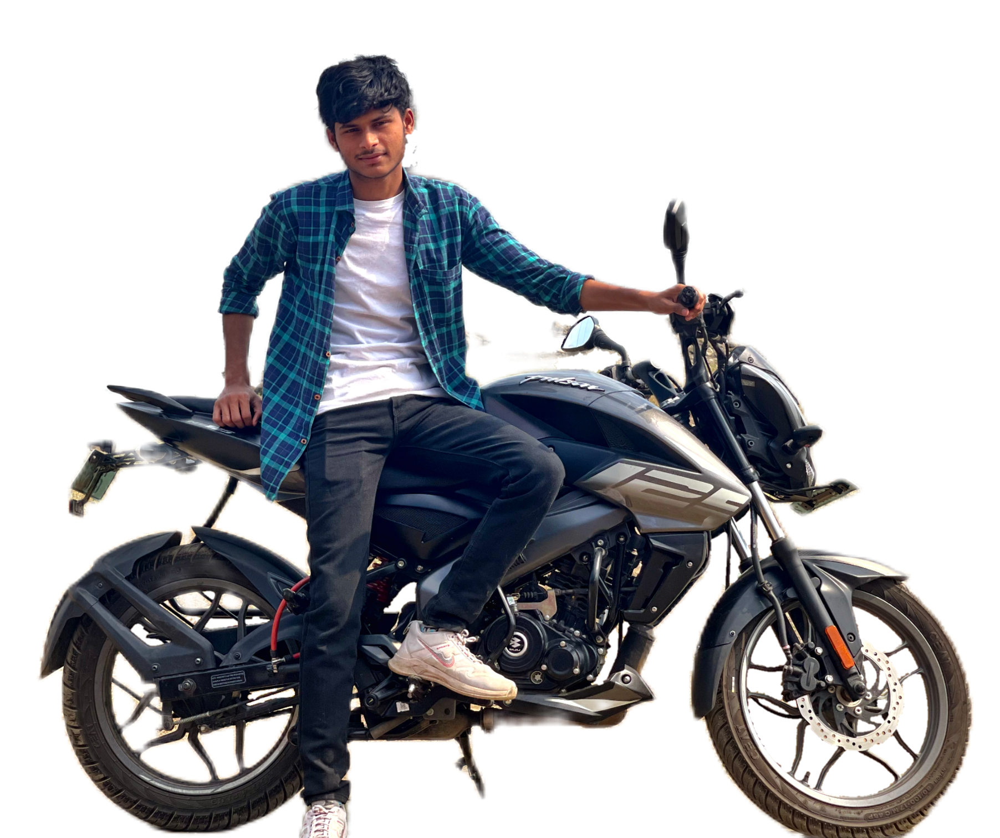
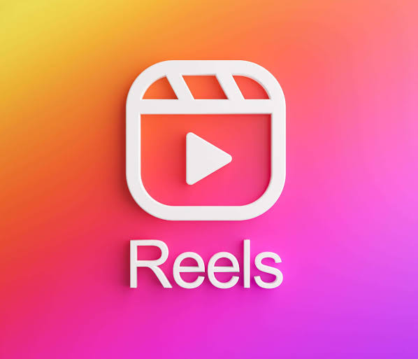
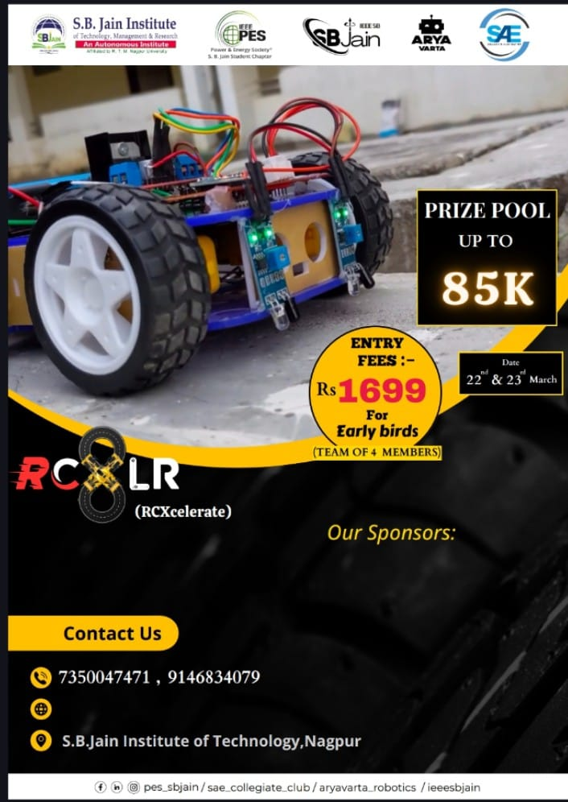
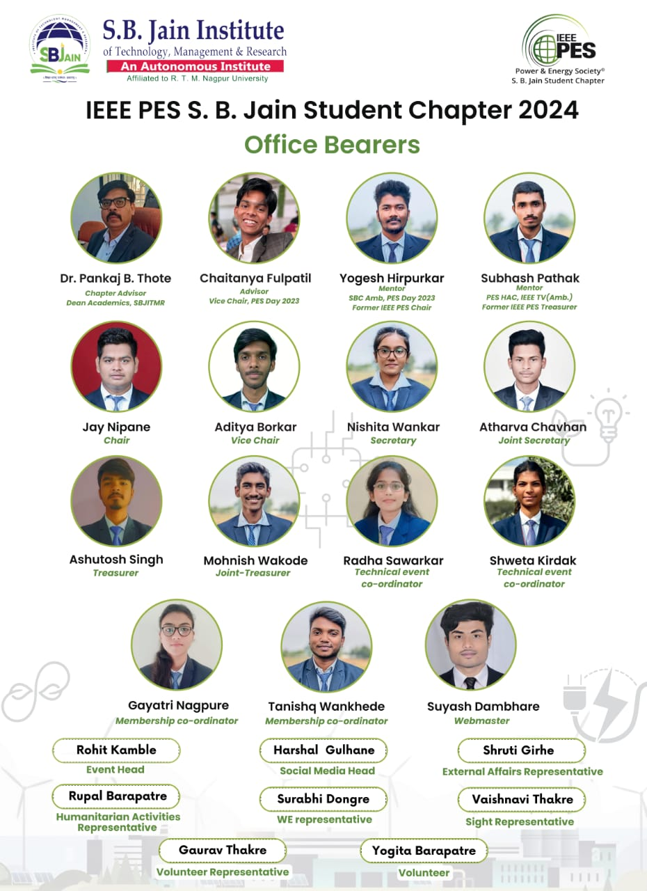
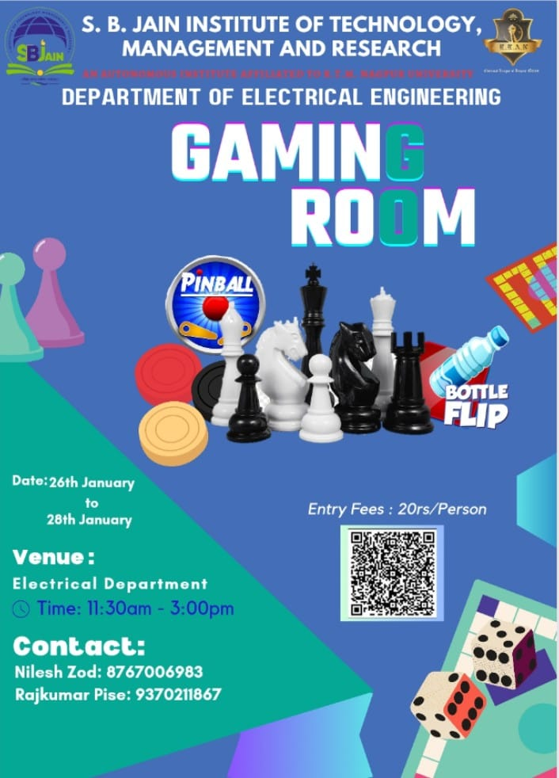
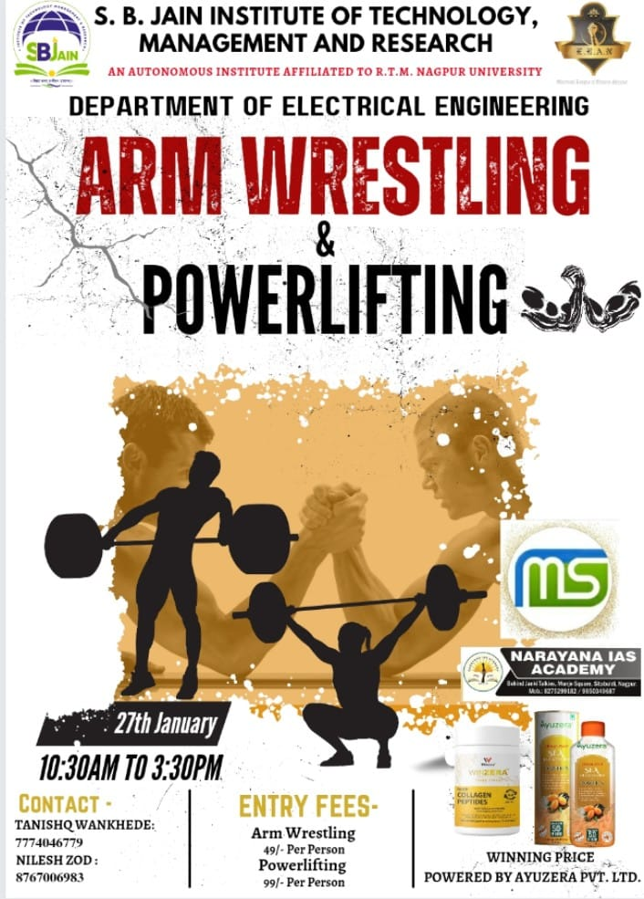

<!DOCTYPE html>
<html lang="en">
<head>
    <meta charset="UTF-8">
    <meta name="viewport" content="width=device-width, initial-scale=1.0">
    <title>Personal branding</title>
    <link rel="stylesheet" href="style.css">
    <!-- boxicon css link -->
    <link href='https://unpkg.com/boxicons@2.1.4/css/boxicons.min.css' rel='stylesheet'>
    <!-- Link Swiper's CSS -->
  <link rel="stylesheet" href="https://cdn.jsdelivr.net/npm/swiper@10/swiper-bundle.min.css" />
</head>
<body>
    

    <header>
        <a href="#" class="logo">CARBON A1</a>
        <ul class="navlist">
            <li><a href="#home" class="active">Home</a></li>
            <li><a href="#about">About</a></li>
            <li><a href="#services">Services</a></li>
            <li><a href="#portfolio">Portfolio</a></li>
            <li><a href="#Poster sample">Poster sample</a></li>
            <li><a href="#contact">Contact</a></li>
        </ul>
        

            <a href="#" class="btn">Let's chat <i class='bx bx-message-dots' ></i></a>
            

                

            

        

    </header>

    <section class="home" id="home">
        

            <h3>Welcome To my World</h3>
            <h1>Hi I'm Atharva</h1>

            

                <h2>Video editor</h2>
            

            
 Crafting lyrical tales in pixels | | turning beats into captions | 🎶✨ |  #WordWeaver #SongLyricsInMyBio Video creator ⭐ nagpur

            

                <a href="mailto:richard@mail.com" class="btn">Hire Me Now ! <i class='bx bx-right-arrow-alt' ></i></a>
                <a href="img/resume.pdf" target="_blank" class="btn d-CV">Download CV <i class='bx bx-download'></i></a>
            

            

                

                    <a href="https://www.instagram.com/carbon__a1?igsh=MTRpaGZha3JhYXh1aA=="><i class='bx bxl-instagram'></i></a>
                    
                

                

                    <a href="https://youtube.com/@carbona1339?si=m41EbQ-H3gMIPwXB"><i class='bx bxl-youtube' ></i></a>
                    
                

                

                    <a href="https://wa.me/qr/DWUZ2ZQMKL6SJ1"><i class='bx bxl-whatsapp'></i></a>
                    
                

                

                    <a href="#"><i class='bx bxl-facebook'></i></a>
                    
                

            

        

        

            
            

                

                    
I'm Youtuber And I'm Video Editor And I'm Designer

                

                <i></i>
            

        

    </section>

    <section class="about" id="about">
        

            
            

                
                
            

        

        

            <h2 class="heading">About Me</h2>
            <h3>3 Year's Experience on Video editing</h3>
            
& photo editing, 1 Year Experience in web desinging

            

                <button class="active">Main Skills</button>
                <button>Awards</button>
                <button>Education</button>
            

            

                

                    

                    
video

                    Reels, youtube long video
                

                

                    
Image

                    Enhance, color
                

                

                    
apps

                    Capcut, photoshop, canva, and many more
                

                

                

                    

                    
Web Design Award

                    Award for creativity and user experience.
                

                

                    
IEEE member

                    as joint secertary in PES chapter
                

                

                    
Hackathons and coding Competiotions

                    Participating in hackathons and coding.
                

                

                

                    

                    
Online Courses and Bootcamps

                    Delight the user and make it work.
                

                

                    
Internships and Work Experience

                    Website , Web Experience , ...
                

                

                    
Bachelor's Degree in Electrical Engineering

                    I Like to move it move it
                

                

            

            

                <a href="img/resume.pdf" target="_blank" class="btn d-CV">Download CV <i class='bx bx-download'></i></a>
            

        

    </section>

    <section class="services" id="services">
        

            <h2 class="heading">My Services</h2>
            what i will do for you
        

        

            

                

                    <i class='bx bx-layer' ></i>
                    
                

                <h3>App Development</h3>
                
Lorem ipsum, dolor sit amet consectetur adipisicing elit. Iure inventore ea nemo ab recusandae modi voluptates maxime ipsam eveniet. Facilis.

                <a href="#" class="readMore">Read More</a>
            

            

                

                    <i class='bx bx-code-alt' ></i>
                    
                

                <h3>Web Development</h3>
                
Lorem ipsum, dolor sit amet consectetur adipisicing elit. Iure inventore ea nemo ab recusandae modi voluptates maxime ipsam eveniet. Facilis.

                <a href="#" class="readMore">Read More</a>
            

            

                

                    <i class='bx bxs-video'></i>
                    
                

                <h3>Video edit</h3>
                
I can edit your video in low amount fast replay every time available for you,also i edit photos like ai,many templates are also available

                <a href="#" class="readMore">Read More</a>
            

            

                

                    <i class='bx bxs-party' ></i>
                    
                

                <h3>Digital Marketing</h3>
                
Lorem ipsum, dolor sit amet consectetur adipisicing elit. Iure inventore ea nemo ab recusandae modi voluptates maxime ipsam eveniet. Facilis.

                <a href="#" class="readMore">Read More</a>
            

        

        

            

                Get It Touch
                <h3>Have a Project On Your Mind</h3>
                <a href="#contact" class="btn">Contact Me</a>
            

            
        

        

            
            
            
            
            
        

    </section>

    <section class="portfolio" id="portfolio">
        

            <h2 class="heading">My Services</h2>
            what i will do for you
        

        

            <button class="button mixitup-control-active" data-filter="all">All Work</button>
            <button class="button" data-filter=".web">Web Development</button>
            <button class="button" data-filter=".uiux">Video edit</button>
            <button class="button" data-filter=".branding">Poster Design</button>
        

        

            

                

                    <h3>Video edit</h3>
                    
reels

                    <a href="#" class="readMore">Explore More</a>
                

                

                    
                

            

            

                

                    <h3>Web Design</h3>
                    
Lorem ipsum dolor sit amet consectetur adipisicing elit. Asperiores, soluta.

                    <a href="#" class="readMore">Explore More</a>
                

                

                    
                

            

            

                

                    <h3>Web Development</h3>
                    
Lorem ipsum dolor sit amet consectetur adipisicing elit. Asperiores, soluta.

                    <a href="#" class="readMore">Explore More</a>
                

                

                    
                

            

            

                

                    <h3>Web Development</h3>
                    
Lorem ipsum dolor sit amet consectetur adipisicing elit. Asperiores, soluta.

                    <a href="#" class="readMore">Explore More</a>
                

                

                    
                

            

            

                

                    <h3>You tube</h3>
                    
Gaming video in my channel #freefire

                    <a href="#" class="readMore">Explore More</a>
                

                

                    
                

            

            

                

                    <h3>Collage posters</h3>
                    
i edit IEEE event poster and ELAN poster

                    <a href="#" class="readMore">Explore More</a>
                

                

                    
                

            

        

    </section>

    <section class="blog" id="blog">
        

            <h2 class="heading">Posters i edit</h2>
            EE student
        

        

            

                

                    

                        
                    

                    

                        <h2>RCXL8</h2>
                        Sunday, feb 25 2024
                        

                            it is event of IEEE PES
                        

                        <a href="#" class="readMore">Explore More</a>
                    

                

                

                    

                        
                    

                    

                        <h2>PES members</h2>
                        Sunday, feb 25 2024
                        

                            New members of IEEE pes
                        

                        <a href="#" class="readMore">Explore More</a>
                    

                

                

                    

                        
                    

                    

                        <h2>Gaming room</h2>
                        Sunday, Jan 10, 2024
                        

                            in technostav
                        

                        <a href="#" class="readMore">Explore More</a>
                    

                

                

                    

                        
                    

                    

                        <h2>Jumanji</h2>
                        Sunday, Jan 11, 2024
                        

                            most popular game
                        

                        <a href="#" class="readMore">Explore More</a>
                    

                

                

                    

                        
                    

                    

                        <h2>Elan members</h2>
                        Sunday, Jan 12, 2024
                        

                            new commiti 2024
                        

                        <a href="#" class="readMore">Explore More</a>
                    

                

                

                    

                        
                    

                    

                        <h2>Power lefting</h2>
                        Sunday, Jan 13, 2024
                        

                            on stage of technostav
                        

                        <a href="#" class="readMore">Explore More</a>
                    

                

            

        

        

        

            
            
            
            
        

    </section>

    <section class="down-box" id="contact">
        

            

                

                    <h2 class="heading">Contact Me</h2>
                    get in touch with me
                

                <form action="#">
                    

                        <input type="text" placeholder="First Name">
                        <input type="text" placeholder="Last Name">
                    

                    <input type="email" placeholder="Email">
                    <input type="text" placeholder="Subject">
                    <textarea name="#" id="" cols="30" rows="10">
                    </textarea>
                    

                        <button type="submit" class="btn">Send Message</button>
                    

                </form>
            

            

                

                    

                        

                            <h2 class="heading">My Skills</h2>
                            Let Me Help you
                        

                        

                            

                                

                                    

                                        <svg xmlns="http://www.w3.org/2000/svg" version="1.1" width="180px" height="180px">
                                            <defs>
                                                <linearGradient id="GradientColor">
                                                <stop offset="0%" stop-color="#e91e63" />
                                                <stop offset="100%" stop-color="#673ab7" />
                                                </linearGradient>
                                            </defs>
                                                <circle cx="85" cy="85" r="75" stroke-linecap="round" />
                                       </svg>
                                       <h2 class="counter">
                                        0%
                                       </h2>
                                    

                                

                                

                                    Video editing
                                

                            

                            

                                

                                    

                                        <svg xmlns="http://www.w3.org/2000/svg" version="1.1" width="180px" height="180px">
                                            <defs>
                                                <linearGradient id="GradientColor">
                                                <stop offset="0%" stop-color="#e91e63" />
                                                <stop offset="100%" stop-color="#673ab7" />
                                                </linearGradient>
                                            </defs>
                                                <circle cx="85" cy="85" r="75" stroke-linecap="round" />
                                       </svg>
                                       <h2 class="counter">
                                        0%
                                       </h2>
                                    

                                

                                

                                    Poster making
                                

                            

                            

                                

                                    

                                        <svg xmlns="http://www.w3.org/2000/svg" version="1.1" width="180px" height="180px">
                                            <defs>
                                                <linearGradient id="GradientColor">
                                                <stop offset="0%" stop-color="#e91e63" />
                                                <stop offset="100%" stop-color="#673ab7" />
                                                </linearGradient>
                                            </defs>
                                                <circle cx="85" cy="85" r="75" stroke-linecap="round" />
                                       </svg>
                                       <h2 class="counter">
                                        0%
                                       </h2>
                                    

                                

                                

                                    communication
                                

                            

                            

                                

                                    

                                        <svg xmlns="http://www.w3.org/2000/svg" version="1.1" width="180px" height="180px">
                                            <defs>
                                                <linearGradient id="GradientColor">
                                                <stop offset="0%" stop-color="#e91e63" />
                                                <stop offset="100%" stop-color="#673ab7" />
                                                </linearGradient>
                                            </defs>
                                                <circle cx="85" cy="85" r="75" stroke-linecap="round" />
                                       </svg>
                                       <h2 class="counter">
                                        0%
                                       </h2>
                                    

                                

                                

                                    content writer
                                

                            

                        

                    

                

            

        

    </section>

    <footer>
        
Copyright © 2024 by CARBON  A1 || All Right Reservd.

    </footer>

    

        
            <i class='bx bxs-chevrons-up' ></i>
        
    

    <!-- scroll reveal  -->
    
    <!-- Swiper JS -->
     
    <!-- mixitup cdn js -->
    
    
</body>
</html>
